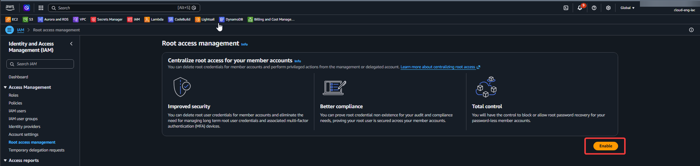
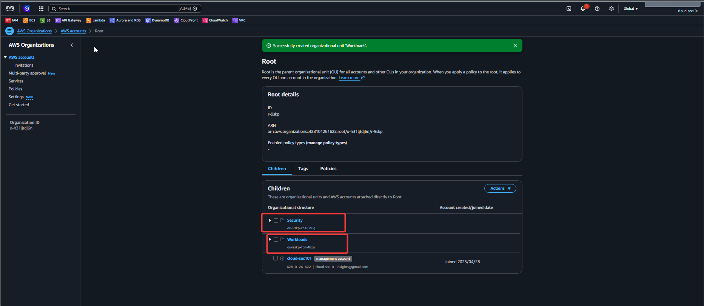
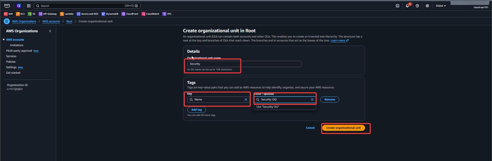

# Set Up AWS Organizations + Root Structure

Create the AWS Organizations structure that Control Tower will sit on top of. You'll leave today with a root OU, a Management account, and two child OUs (Security and Workloads) — the skeleton of your landing zone.

## Step-by-Step

01. Log into AWS free tier account (root account). This becomes your Management Account. Tag it clearly.
02. Navigate to AWS Organizations → Enable All Features. This unlocks SCPs (Service Control Policies).
03. Create two child OUs under Root: name them Security and Workloads.
04. Create 3 member accounts via Organizations: Security-Audit, Dev, and Prod. Use email aliases (e.g. yourname+dev@gmail.com). These are free.
05. Move Security-Audit into the Security OU. Move Dev and Prod into the Workloads OU.
06. Create your first SCP: a DenyExpensiveServices policy — attach it to the Workloads OU to block EC2 types above t3.medium.
07. Document the structure in a README.md in a new GitHub repo called aws-landing-zone. Screenshot your OU tree.

**Step 1: Gather Your Email Aliases**

Because every AWS account requires a unique root email address, you will use Gmail's plus-addressing to route all root notifications to your single primary inbox.
Assuming your primary email is `yourname@gmail.com`, prepare these three variations:

* **Security-Audit:** `yourname+security@gmail.com`
* **Development (Dev):** `yourname+dev@gmail.com`
* **Production (Prod):** `yourname+prod@gmail.com`

---

**Step 2: Create the Member Accounts in AWS**

- Log into the **AWS Management Console** using the root or administrator credentials of your **Management Account** (the main/billing account).
- Search for and navigate to the **AWS Organizations** console.
- On the left navigation pane, select **AWS accounts**.



- Click the **Add an AWS account** button, then select **Create an AWS account**.



- Fill out the details for the first account (**Security-Audit**):
    * **AWS account name:** `Security-Audit`
    * **Root user email address:** `yourname+security@gmail.com`
    * **IAM role name:** Leave it as the default `OrganizationAccountAccessRole` (this allows you to easily switch roles from your main account to manage it later).
- Click **Create AWS account**.



- **Repeat this exact process** two more times to create the remaining accounts:
    * Name: `Development` | Email: `yourname+dev@gmail.com`
    * Name: `Production` | Email: `yourname+prod@gmail.com`


> 💡 *Note: It may take a couple of minutes for AWS to finish provisioning each account. You can track the status under the "Creation status" tab in the Organizations dashboard.*

---

**Step 3: Access and Secure the New Accounts (The "Gotcha")**

When AWS Organizations provisions a new member account, it generates a random, complex password for the root user that you do not see. To set up your password and log in for the first time:

- Go to the [AWS Sign-In Console](https://signin.aws.amazon.com/).
- Select **Root user** and enter the email alias for the account you want to access (e.g., `yourname+security@gmail.com`). Click *Next*.
- On the password screen, click **Forgot password?**.
- Complete the security check. AWS will send a password reset link to your primary Gmail inbox.
- Open your Gmail, click the reset link, and set a strong, secure password for that member account.
- Log in with your new password and **immediately enable Multi-Factor Authentication (MFA)** on the root account for maximum security.
- Repeat this for all three accounts.

---

## Best Practice Next Steps

Now that your accounts are created, you should avoid logging in as the root user for daily tasks:

* **Set up AWS IAM Identity Center (successor to AWS SSO):** This allows you to create individual user accounts or map your existing credentials so you can seamlessly hop between the Dev, Prod, and Security-Audit environments using a single single-sign-on portal.
* **Organize into OUs:** In the Organizations console, consider creating **Organizational Units (OUs)** (like a `Core` OU for Security-Audit and a `Workloads` OU for Dev and Prod) to easily apply uniform security policies (SCPs) later.


## SCP Starter

SCP Starter — Deny Large EC2 (paste into SCP editor)

```
{
  "Version": "2012-10-17",
  "Statement": [{
    "Sid": "DenyExpensiveEC2",
    "Effect": "Deny",
    "Action": "ec2:RunInstances",
    "Resource": "arn:aws:ec2:*:*:instance/*",
    "Condition": {
      "StringNotLike": {
        "ec2:InstanceType": ["t2.*", "t3.*"]
      }
    }
  }]
}
```

