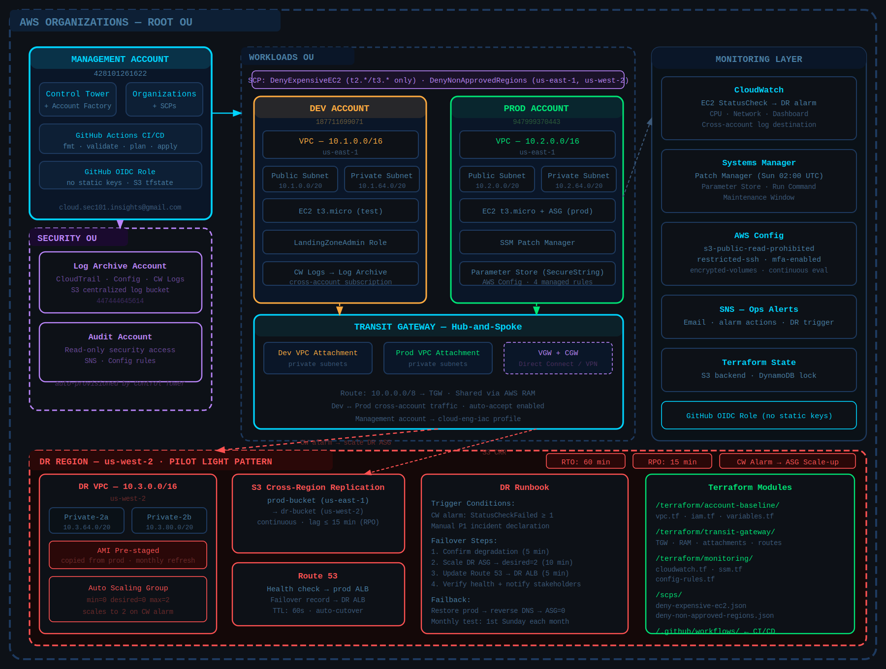
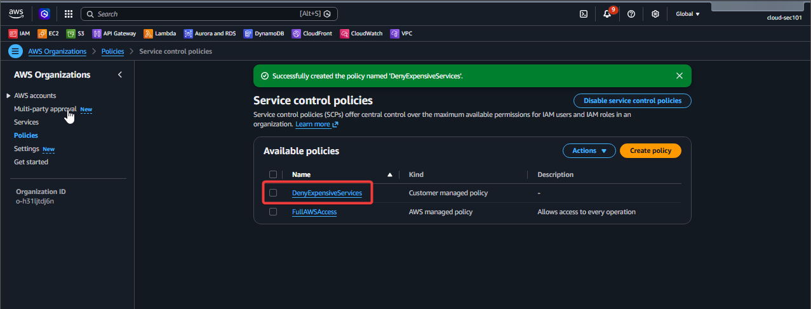

# Set Up AWS Organizations + Root Structure

Create the AWS Organizations structure that Control Tower will sit on top of. You'll leave today with a root OU, a Management account, and two child OUs (Security and Workloads) — the skeleton of your landing zone.



## Step-by-Step

01. Log into AWS free tier account (root account). This becomes your Management Account. Tag it clearly.
02. Navigate to AWS Organizations → Enable All Features. This unlocks SCPs (Service Control Policies).
03. Create two child OUs under Root: name them Security and Workloads.
04. Create 3 member accounts via Organizations: Security-Audit, Dev, and Prod. Use email aliases (e.g. yourname+dev@gmail.com). These are free.
05. Move Security-Audit into the Security OU. Move Dev and Prod into the Workloads OU.
06. Create your first SCP: a DenyExpensiveServices policy — attach it to the Workloads OU to block EC2 types above t3.medium.
07. Document the structure in a README.md in a new GitHub repo called aws-landing-zone. Screenshot your OU tree.

Here are the correct plus-addresses for your AWS member accounts using `cloud.sec101.insights@gmail.com` as the base:

---

## Your Email Aliases

| Account | AWS Account Name | Root Email Address |
|---------|-----------------|-------------------|
| Management | *(already exists)* | `cloud.sec101.insights@gmail.com` |
| Security-Audit | `Security-Audit` | `cloud.sec101.insights+security2@gmail.com` |
| Development | `Development` | `cloud.sec101.insights+dev2@gmail.com` |
| Production | `Production` | `cloud.sec101.insights+prod2@gmail.com` |

---

## How Plus-Addressing Works

Gmail ignores everything between `+` and `@` for delivery — so all four addresses land in the **same inbox** (`cloud.sec101.insights@gmail.com`), but AWS treats each as a **unique email address**, which is required since every AWS account must have a distinct root email.

---

## What to Enter in AWS Organizations

When you reach **Step 2 → Create AWS account**, fill in each account like this:

```bash
# Verify you're using the right profile for your management account
aws organizations list-accounts \
  --profile cloud-eng-iac \
  --query 'Accounts[?Status==`ACTIVE`].{ID:Id,Name:Name,Email:Email}' \
  --output table

# Create Security-Audit
aws organizations create-account \
  --email "cloud.sec101.insights+security2@gmail.com" \
  --account-name "Security-Audit" \
  --role-name "OrganizationAccountAccessRole" \
  --profile cloud-eng-iac

# Create Development
aws organizations create-account \
  --email "cloud.sec101.insights+dev2@gmail.com" \
  --account-name "Development" \
  --role-name "OrganizationAccountAccessRole" \
  --profile cloud-eng-iac

# Create Production
aws organizations create-account \
  --email "cloud.sec101.insights+prod2@gmail.com" \
  --account-name "Production" \
  --role-name "OrganizationAccountAccessRole" \
  --profile cloud-eng-iac

# Each create-account call returns a request ID, not the account ID immediately — account creation is async and takes 1–2 minutes. Check the status like this:

# Check creation status — replace REQUEST_ID with the value from each create-account response
aws organizations describe-create-account-status \
  --create-account-request-id <REQUEST_ID> \
  --profile cloud-eng-iac \
  --query 'CreateAccountStatus.{State:State,AccountId:AccountId,FailureReason:FailureReason}'
```

**Account 1 — Security-Audit**
```
AWS account name:       Security-Audit
Root user email:        cloud.sec101.insights+security2@gmail.com
IAM role name:          OrganizationAccountAccessRole
```

**Account 2 — Development**
```
AWS account name:       Development
Root user email:        cloud.sec101.insights+dev2@gmail.com
IAM role name:          OrganizationAccountAccessRole
```

**Account 3 — Production**
```
AWS account name:       Production
Root user email:        cloud.sec101.insights+prod2@gmail.com
IAM role name:          OrganizationAccountAccessRole
```

---

## Move Accounts into OUs

```bash
# First get your OU IDs
aws organizations list-roots \
  --profile cloud-eng-iac \
  --query 'Roots[0].Id' \
  --output text

# List OUs under root — replace ROOT_ID with the value above
aws organizations list-organizational-units-for-parent \
  --parent-id <ROOT_ID> \
  --profile cloud-eng-iac \
  --query 'OrganizationalUnits[*].{ID:Id,Name:Name}' \
  --output table

# Move Security-Audit into Security OU
aws organizations move-account \
  --account-id <SECURITY_AUDIT_NEW_ID> \
  --source-parent-id <ROOT_ID> \
  --destination-parent-id <SECURITY_OU_ID> \
  --profile cloud-eng-iac

# Move Development into Workloads OU
aws organizations move-account \
  --account-id <DEV_NEW_ID> \
  --source-parent-id <ROOT_ID> \
  --destination-parent-id <WORKLOADS_OU_ID> \
  --profile cloud-eng-iac

# Move Production into Workloads OU
aws organizations move-account \
  --account-id <PROD_NEW_ID> \
  --source-parent-id <ROOT_ID> \
  --destination-parent-id <WORKLOADS_OU_ID> \
  --profile cloud-eng-iac

```

## Final Verification

You should see all 4 accounts ACTIVE with the correct +security2, +dev2, +prod2 emails.

```bash
aws organizations list-accounts \
  --profile cloud-eng-iac \
  --query 'Accounts[*].{ID:Id,Name:Name,Email:Email,Status:Status}' \
  --output table

```

## One Thing to Watch For

AWS sends a **verification email** to each root address when the account is created. Since all three land in the same Gmail inbox, check for emails from `no-reply@signin.aws` and verify each one. They'll arrive within a few minutes of creating each account — complete the verification before moving to the next account creation to keep things clean.


> 💡 *Note: It may take a couple of minutes for AWS to finish provisioning each account. You can track the status under the "Creation status" tab in the Organizations dashboard.*

---

**Step 3: Access and Secure the New Accounts (The "Gotcha")**

When AWS Organizations provisions a new member account, it generates a random, complex password for the root user that you do not see. To set up your password and log in for the first time:

- Go to the [AWS Sign-In Console](https://signin.aws.amazon.com/).
- Select **Root user** and enter the email alias for the account you want to access (e.g., `yourname+security@gmail.com`). Click *Next*.
- On the password screen, click **Forgot password?**.
- Complete the security check. AWS will send a password reset link to your primary Gmail inbox.
- Open your Gmail, click the reset link, and set a strong, secure password for that member account.
- Log in with your new password and **immediately enable Multi-Factor Authentication (MFA)** on the root account for maximum security.
- Repeat this for all three accounts.

---

## Best Practice Next Steps

Now that your accounts are created, you should avoid logging in as the root user for daily tasks:

* **Set up AWS IAM Identity Center (successor to AWS SSO):** This allows you to create individual user accounts or map your existing credentials so you can seamlessly hop between the Dev, Prod, and Security-Audit environments using a single single-sign-on portal.
* **Organize into OUs:** In the Organizations console, consider creating **Organizational Units (OUs)** (like a `Core` OU for Security-Audit and a `Workloads` OU for Dev and Prod) to easily apply uniform security policies (SCPs) later.


## SCP Starter

SCP Starter — Deny Large EC2 (paste into SCP editor)

```
{
  "Version": "2012-10-17",
  "Statement": [{
    "Sid": "DenyExpensiveEC2",
    "Effect": "Deny",
    "Action": "ec2:RunInstances",
    "Resource": "arn:aws:ec2:*:*:instance/*",
    "Condition": {
      "StringNotLike": {
        "ec2:InstanceType": ["t2.*", "t3.*"]
      }
    }
  }]
}
```

